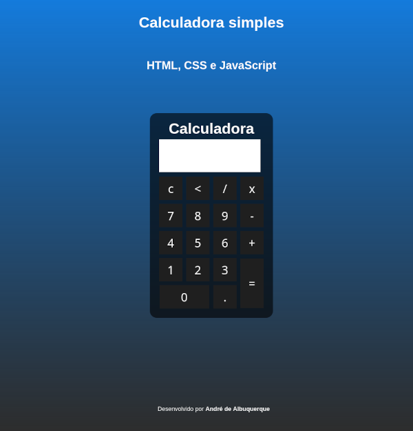

# calculadora
<h1>Calculadora simples com HTML, CSS e JavaScript</h1>

Projeto para aplicação de estudos em HTML, CSS e JavaScript
  
  

Disponível em: https://andre-albuquerque.github.io/calculadora/

